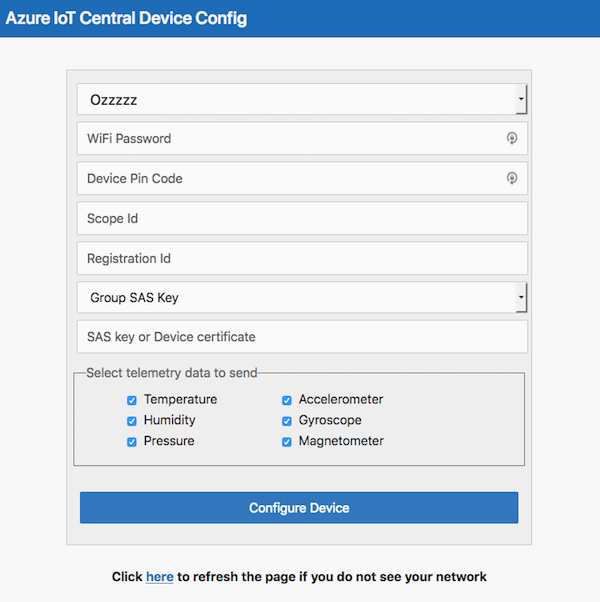

# Microsoft IoT Central Reference Firmware for AZ3166 dev kit

## Description:

If you are interested in implementation details and are already an IoT Hub user, this document will help you understand the details of how the device communicates with Microsoft IoT Central through Azure IoT Hub.

## The device telemetry payload:

Depending on how you configure the device it will send a subset of this telemetry payload.  A full telemetry payload will look like this when observed in the iothub-explorer event-monitor command:

```
{
  "humidity": 40,
  "temp": 26.6,
  "pressure": 1007.98,
  "magnetometerX": 43,
  "magnetometerY": 217,
  "magnetometerZ": -675,
  "accelerometerX": 13,
  "accelerometerY": -122,
  "accelerometerZ": 1019,
  "gyroscopeX": -350,
  "gyroscopeY": -980,
  "gyroscopeZ": 1400
}
```

Type, units, and range for the telemetry is:

| **Measure** | **Type** | **Units** | **Min** | **Max** |
| --- | --- | --- | --- | --- |
| humidity | float | % relative humidity | 0 | +100 |
| temp | float | °C | -40 | +120 |
| pressure | float | hPa | +260 | +1260 |
| magnetometerX,Y,Z | int | mgauss | -1000 | +1000 |
| accelerometerX,Y,Z | int | micro g (mg) | -2000 | +2000 |
| gyroscopeX,Y,Z | int | Micro degrees per second (mdps) | -2000 | +2000 |


Each telemetry also has a timestamp property associated with it in the format

```
{
  "timestamp": "Sun Oct  1 18:18:36 2017"
}
```

***

## General onboarding the device onto an IoT Hub:

For testing purposes, you may want to add the device to a general IoT Hub, so you can observe the device in action easier as you have access to the hub and device connection string.  The following steps will get the device connected to your hub and sending data.  Many of these steps will be repeated when adding the device to Microsoft IoT Central.

### Step 1:

Take the device out of the box and plug it into a USB power supply (USB power adapter, USB powered hub, Computer USB socket).  The device should power up with the following screen displayed:


The device is now in access point (AP) mode and is providing a WiFi access point that you can connect to.  Before we connect to this WiFi we need to get a device connection string for the device to use.  Go to the Azure portal ( [https://portal.azure.com](https://portal.azure.com/) ) and sign in.  Either go to your IoT hub that you have provisioned or provision a new hub (a free hub sku will work fine) from the market place (instructions for doing this can be found here ( [https://docs.microsoft.com/en-us/azure/iot-hub/iot-hub-csharp-csharp-getstarted](https://docs.microsoft.com/en-us/azure/iot-hub/iot-hub-csharp-csharp-getstarted) ).

Once you have a hub provisioned select "Device Explorer" in the left navigation menu and click the &#39;+&#39; icon to add a new device.  Give the device a name and then click "Save".  The device will be displayed in the list of devices and you need to click the device to get to the device details page.  Now click the Copy icon to the right of the Connection string – primary key to copy the connection string into the copy/paste buffer of your computer.


You can leave it in the copy/paste buffer or copy it into notepad for safe keeping.  If you are new to using IoT Hub and the Azure Portal please follow the detailed instructions found in the getting started guide ( [https://docs.microsoft.com/en-us/azure/iot-hub/iot-hub-csharp-csharp-getstarted](https://docs.microsoft.com/en-us/azure/iot-hub/iot-hub-csharp-csharp-getstarted) ).

### Step 2:

Now change the WiFi of your computer, phone, or tablet to the name shown on the screen of the device.  Once connected you will see that you do not have internet access, this is expected, and we shall only be on this network for a short time as we configure the device.  Open your internet browser and enter the URL [http://192.168.0.1/start](http://192.168.0.1/start) .  The following web page should be displayed:

 

Select from the dropdown the WiFi network your device should connect to.  The list will only contain networks that the device is capable of connecting to so don&#39;t be surprised if not all networks you see on your computer are visible.  After selecting the WiFi network, enter the password for the network.  Then paste in the device connection string we obtained in step 2 into the connection string field.  Now select the telemetry data you want the device to send to your hub.  By default all are selected but you are free to select only a few if you want.  You can select zero telemetry options but then you will be sending just an empty JSON body to the hub each time and that&#39;s not very interesting.

Click the "Configure Device" button on the page when you are ready and the configuration data will be sent to the device and saved in the EEPROM on the device, so it will not be lost during power cycles of the device. You should now see the following web page:

 
 

### Step 3:

Reset the device by pressing the reset button on the upper right corner of the device:


The device will reboot and connect to the WiFi network you chose in step 2 and start sending telemetry data to your hub.  The device should now show the following on it&#39;s display:

 

### Step 4:

We can confirm that data is being sent by using the iothub-explorer tool.  To use the tool you will need to have node.js installed ( [https://nodejs.org](https://nodejs.org/) ) then from the command line issue the command (you may need to use sudo or an admin command line to install this):

```
npm install –g iothub-explorer
```

Now use the command:

```
iothub-explorer monitor-events <device-name> --login "HostName=xxxxxx.azure-devices.net;SharedAccessKeyName=iothubowner;SharedAccessKey=xxxxxxxxxxxxxxxxxxxxxxxxxxxxxxxxxxx"
```

You can get the &lt;device-name&gt; by pressing the B button on the device to get to the device information screen, the second line is the device name.  For the hub connection string return back to the Azure portal ( [https://portal.azure.com](https://portal.azure.com/) ) and go to your hub.  Then select from the left-hand navigation menu "Shared access policies", click on "iothubowner", and click the copy icon to the right of "Connection string – primary key".

After executing the command you should start to see the telemetry data being streamed from your device to the IoT Hub.  Congratulations you have connected the device to Azure IoT, continue reading to see what else the device can do now it&#39;s connected to your Azure IoT Hub.

***

## Connecting the device to Microsoft IoT Central:

Please visit our [general documentation site](https://aka.ms/iotcentral-doc-mxchip) for a tutorial on how to connect the device to Microsoft IoT Central. 

***

## Sending telemetry:

The device sends telemetry automatically every 5 seconds when running.  The count of sent telemetry will increment every 5 seconds and the blue Azure LED will blink when telemetry is sent by the device.  The telemetry sent will vary based on the selections you made in the configuration of the device.  The telemetry can be observed from the IoT Hub side by using the iothub-explorer command:

```
iothub-explorer monitor-events <device-name> --login "HostName=xxxxxx.azure-devices.net;SharedAccessKeyName=iothubowner;SharedAccessKey=xxxxxxxxxxxxxxxxxxxxxxxxxxxxxxxxxxx"
```

The device name can be obtained from the device screen on the devices display by pressing the B button to rotate the display to that screen.  The hub connection screen can be obtained from the Azure Portal web page for your hub.

***

## Sending State telemetry updates:

Status changes are a form of telemetry sent by a device to Microsoft IoT Central.  The device firmware is coded to send a device state change when the A button is pressed.  This rotates the device through three states: Normal, Caution, and Danger.  Each state change sends a telemetry payload that looks like this:

```
{
  "deviceState": "CAUTION"
}
```

With an associated timestamp property in the format:

```
{
  "timestamp": "Sun Oct  1 18:02:16 2017"
}
```

This state change telemetry can be observed using iothub-explorer command:

```
iothub-explorer monitor-events <device-name> --login "HostName=xxxxxx.azure-devices.net;SharedAccessKeyName=iothubowner;SharedAccessKey=xxxxxxxxxxxxxxxxxxxxxxxxxxxxxxxxxxx"
```

The device name can be obtained from the device screen on the devices display by pressing the B button to rotate the display to that screen.  The hub connection screen can be obtained from the Azure Portal web page for your hub.  Note that the device change event will be surrounded by normal telemetry events in the output.

***

## Sending the "doubleTap" reported property:

Tapping the board on the desk a couple of times will generate a doubletap event from the accelerometer sensor and a reported property is set that contains a timestamp of the double tap event.  The right-hand number on the display for the twin line will also be incremented when the reported property is written to the twin.  The reported property looks like this:

```
reported:
    doubleTap:
      timestamp: Sat Sep 30 17:01:32 2017
```

The reported property can be checked by issuing the following iothub-explorer command to display the current twin setting:

```
iothub-explorer get-twin <device-name>
```

Note that this reported property can only be sent every 20 seconds maximum.  Any double tap events registered during the 20 second window of a previously sent reported property will be ignored.

** **

## Setting the twin "fanSpeed" desired property:

By sending a desired property to the device the fan speed can be set to a value.  The command to set the desired property using iothub-explorer is:

```
iothub-explorer update-twin <device-name> '{"properties":{"desired":{"fanSpeed":{"value":100}}}}'
```

When the desired property is set on the cloud (IoT hub) side the desired state will be sent to the device.  If you have headphones connected to the device, you will hear the sound of a fan running for a short period of time (~2 seconds).  The device will also acknowledge the desired request by sending a matching reported property with the value, a status, and a desired version that will match the $version of the desired property request.  When a desired property is received the left-hand number on the twin line of the display will be incremented and when the desired property is acknowledged the right-hand number will be incremented.  Be aware that there can be a small lag between the twin properties being set on the device and being observed in the cloud (and visa-versa) We can look at the twin with the following iothub-explorer command:

```
iothub-explorer get-twin <device-name>
```

We should see the following desired and reported properties:

```
properties:
  desired:
    fanSpeed:
      value: 100
      $version:  4

  reported:
    fanSpeed:
      value:          100
      status:         complete
      desiredVersion: 4
```

If several desired properties are set whilst the device is off line then they will be stored in the cloud until the device next connects.  Then the full digital twin is sent down to the device and all the desired properties will be checked to see if they have been acted upon.  The firmware looks at each desired property and looks for an equivalent reported property.  If the reported property is not found or the desired version numbers do not match then the desired property is acted upon and the reported property updated to reach a consistent state.  We can mimic this behavior by disconnecting the device then issuing the command:

```
iothub-explorer update-twin <device-name> '{"properties":{"desired":{"fanSpeed":{"value":100}}}}'
```

Then reconnect the device and after a number of telemetry sends (about five or six) the twin will be received and you should hear the fan noise and see the twin counter increment on the display.  You can check that the twin has become consistent by looking at the twin in the cloud using the command:

```
iothub-explorer get-twin <device-name>
```

***