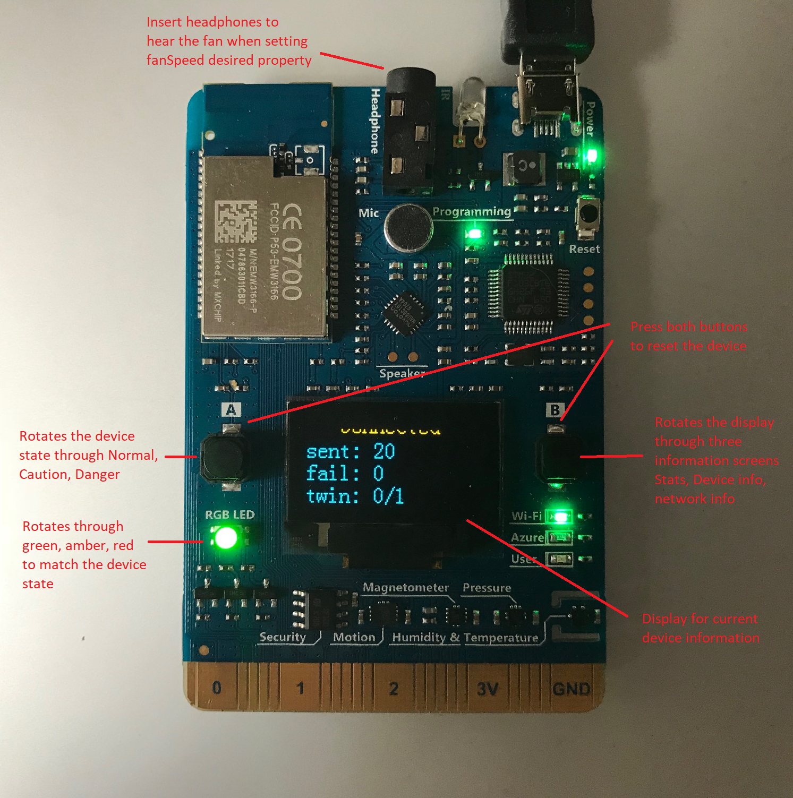

# Azure IoT Central Reference Firmware for AZ3166 dev kit

## Description:

An example of writing a firmware solution to send data to Azure IoT Central and
to receive events back from Azure IoT Central to be processed by the device.

You are free to take this code and the concepts used, and use them as a basis
for your own firmware for Azure IoT Central.

The aim of this firmware and code is two-fold:

- To provide a good "out of the box" experience for someone wanting to connect a
device to Azure IoT Central and see real data sent to Azure IoT Central.
The firmware was designed to simplify the onboarding experience via a web UX
configuration and allow non-developer users to get a device onto Azure IoT
Central very easily.

- To illustrate how to write a functioning firmware for an mbed device that
supports the features of Azure IoT Central. The code pulls together many of the
individual samples available in the Azure IoT device C SDK into a cohesive story,
using relatively simple code. The code was written in C/CPP using the Arduino
libraries in an attempt to make it accessible to all development levels from
hobbyist to professional. Tooling for the code is done with Visual Studio Code
and the Arduino plugin allowing for visual debugging in the IDE of the code.

***

## Features implemented:

- Simple onboarding via a web UX
- Simple device reset (press and hold the A &amp; B buttons at the same time)
- Display shows count of messages, errors, twin events, network information,
and device name (cycle through screens with B button)
- Telemetry sent for all onboard sensors (configurable)
- State change telemetry sent when button A pressed and the device cycles
through the three states (NORMAL, CAUTION, DANGER)
- Reported twin property die number is sent when shaking the device
(uses accelerometer sensor data)
- Desired twin property to simulate turning on a fan (fan sound plays from
onboard headphone jack)
- Desired twin properties of current and voltage of the device (trigger a bar
graph animation)
- Desired twin property of IR blaster that sends a short burst from the IR
emmitter on the board
- Cloud to device messages (supports sending a message to display on the screen)
- Direct twin method calls (supports asking the device to play a rainbow
sequence on the RGB LED)
- LED status of network, Azure IoT send events, Azure IoT error events, and
current device state (NORMAL=green, CAUTION=amber, DANGER=red)
- GroupSas and GroupX509 Authentication

***

## The board and its features:



Pressing the B button will rotate through three screens of information in the
following order "data transmission statistics" -&gt; "Device information" -&gt;
"Network information" –&gt; back to "data transmission statistics".  The screens
look like this:


The Data transmission screen (first screen above) has the following information
by line:

- Count of sent telemetry events (includes telemetry payloads and state change
telemetry payloads)
- Count of failed telemetry events
- Twin events desired / reported

***

## Connecting the device to Azure IoT Central:

Please visit our [general documentation site](https://aka.ms/iotcentral-doc-mxchip)
for a tutorial on how to connect the device to Azure IoT Central.

***

## Resetting the device:

To reset the board press and hold both the A and the B buttons together until
the device displays "Resetting device".  The device will then return to the AP
mode and display the WiFi hotspot name for you to connect to and reconfigure the
board. This action wipes all the configuration data from the device, essentially
factory resetting it.

***

## Updating the firmware on the device:

Please visit our release page on Github for the latest firmware.

***

## Building the firmware:

Install [iotz](https://github.com/azure/iotz). You will need `Docker` and `node.js` (8+) is installed on your machine.

Once `iotz` is installed, `initialize` the project (once)
```
iotz init
```

and compile
```
iotz compile
```

finally, copy `BUILD/iotCentral.ino.bin` into mxchip disk drive

### 3rd Party

This firmware uses the following libraries:

- Libraries installed by the MXChip IoT DevKit (https://microsoft.github.io/azure-iot-developer-kit/):
    - AureIoTHub - https://github.com/Azure/azure-iot-arduino
    - AzureIoTUtility - https://github.com/Azure/azure-iot-arduino-utility
    - AzureIoTProtocol_MQTT - https://github.com/Azure/azure-iot-arduino-protocol-mqtt

-   Third party libraries used:
    - Parson ( http://kgabis.github.com/parson/ ) Copyright (c) 2012 - 2017 Krzysztof Gabis

### Debugging:

- Install the Azure IoT Developer Kit by following the manual installation
instructions at [https://microsoft.github.io/azure-iot-developer-kit/docs/installation/](https://microsoft.github.io/azure-iot-developer-kit/docs/installation/)
There are instructions for Windows and macOS PC&#39;s.  You can ignore Step 1 as
this is not needed to build the firmware.

- Ensure your device has been upgraded to the latest base firmware.
Instructions for downloading the firmware from here [https://microsoft.github.io/azure-iot-developer-kit/versions/](https://microsoft.github.io/azure-iot-developer-kit/versions/)
- Install Git tools for your operating system
- Clone the IoTCentral firmware repository on Github [https://github.com/Azure/iot-central-firmware](https://github.com/Azure/iot-central-firmware)

Opening the code in Visual Studio Code and getting connected to the device:

- Connect the development board to your computer via the USB cable
- From the command line change directory into the directory you cloned the repo
and use the command:  code .
- Once VS Code loads you should set the serial port of the board. Use `CTRL+SHIFT+P`
(or `CMD+SHIFT+P` for MacOS) and type **Arduino** then find and select
**Arduino: Select Serial Port**. A list of serial ports will be displayed select
the one the device is connected to.  In windows this can be found by looking at
the device manager and looking in Ports for the COM port for the
STMicroelectronics STLink Virtual COM Port.  On macOS the port will be the one
with /dev/cu.usbmodemXXXX STMicroElectronics
- Set the Serial board rate to 9600.  Use `CTRL+SHIFT+P` (or `CMD+SHIFT+P` for
MacOS) and type **Arduino** then find and select **Arduino: Change Baud rate**
and select 9600 from the list.
- Select the board type. Use `CTRL+SHIFT+P` (or `CMD+SHIFT+P` for MacOS) and
type **Arduino** and then find and select **Arduino: Change Board Type** and
select **MXCHIP AZ3166** from the list.

Building and uploading the code to the device:

- To build the code use `CTRL+SHIFT+P` (or `CMD+SHIFT+P` for MacOS) and
type **Arduino** then find and select **Arduino: Upload**
- The source will build and be uploaded to the device, this can take several
minutes.  If there are errors they will be displayed in the Output window
- Once uploaded the device will restart and boot into the newly uploaded
firmware and start executing

You can debug via Serial print commands in the code or with the ST-Link
debugger that provides full visual debugging.  To observe Serial output you need
to start the serial port monitor in VS Code.  Use `CTRL+SHIFT+P` macOS
(`CMD+SHIFT+P`) and type **Arduino** then find and select
**Arduino: Open Serial Monitor**.  The Serial port monitor will be opened in
the output window and serial port messages will be displayed.  If the output
is garbled then check to make sure you have the baud rate set at 9600.

For more complete debugging you can select the debug tool on the left-hand
toolbar of VS Code.  Then set any breakpoints in the code as normal and press
the debug play button in the top left-hand corner.  The debugger will start
shortly and breakpoints will be observed.  When a breakpoint fires you can
look at variable values and step through the code like any normal debugging
session.

### Note:

- Debugging the device can be a little unstable at times, placing breakpoints
during debugging will sometimes not be honored and stepping through the code is
quite slow.
- When exiting debugging (pressing the stop button in the debugger toolbar) the
device might be in an inconsistent state (programming LED flashing) this will
result in uploads failing and new debugging sessions also failing.  To resolve
this unplug the USB cable from the computer and plug it back in. The device and
COM port will reset and the device will function normally from that point on.
- When debugging a shadow copy of the code is used and will be shown in the VS
code editor. Be aware that making changes in the shadow copy will not be
persisted in the real source code and you will lose them in subsequent
builds – BE AWARE OF THIS!!

***

## Troubleshooting:

- Sometimes when resetting the device the web page for configuring the device
( [http://192.168.0.1/start](http://192.168.0.1/start) ) will fail to load or
display a blank page.  Please reset the device and it will come up in AP mode
and you can reconnect to the WiFi hotspot the board supplies and try to access
the page again.

***

## Contributing:

This project welcomes contributions and suggestions. Most contributions require
you to agree to a Contributor License Agreement (CLA) declaring that you have
the right to, and actually do, grant us the rights to use your contribution.
For details, visit  [https://cla.microsoft.com](https://cla.microsoft.com/).

When you submit a pull request, a CLA-bot will automatically determine whether
you need to provide a CLA and decorate the PR appropriately (e.g., label,
comment). Simply follow the instructions provided by the bot. You will only
need to do this once across all repos using our CLA.

This project has adopted the  [Microsoft Open Source Code of Conduct](https://opensource.microsoft.com/codeofconduct/).
For more information see the  [Code of Conduct FAQ](https://opensource.microsoft.com/codeofconduct/faq/)
or contact  [opencode@microsoft.com](mailto:opencode@microsoft.com) with any
additional questions or comments.