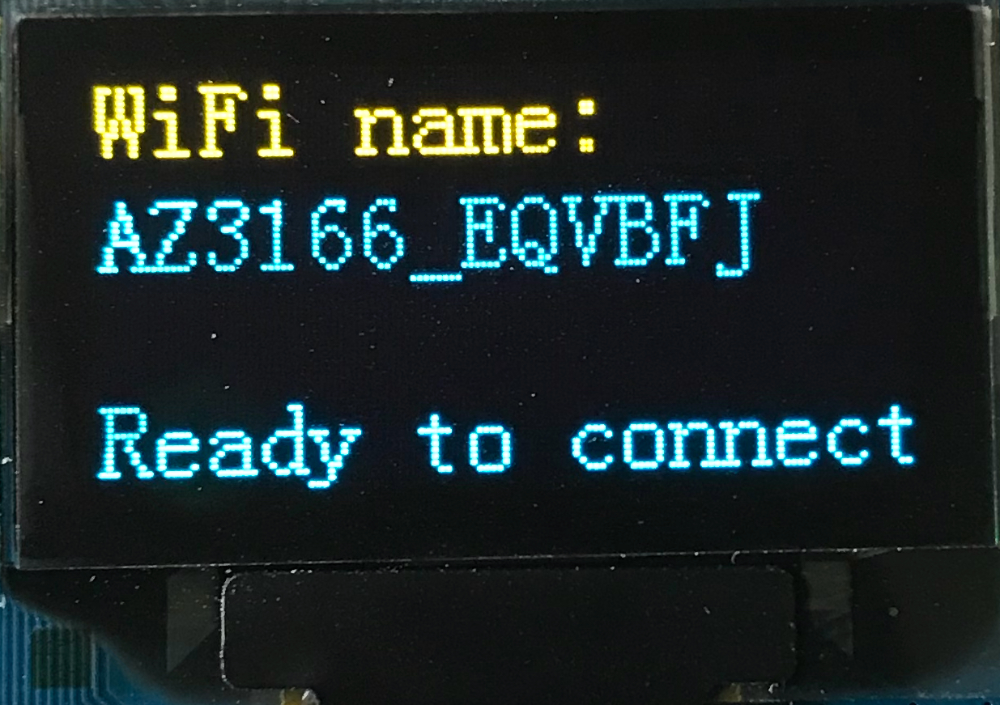
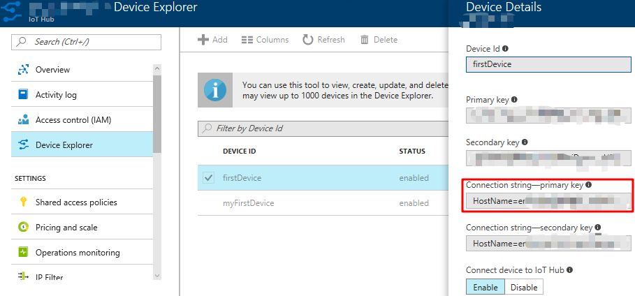
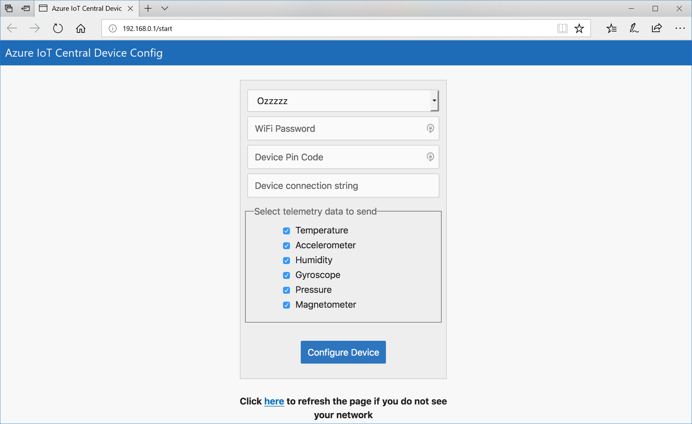
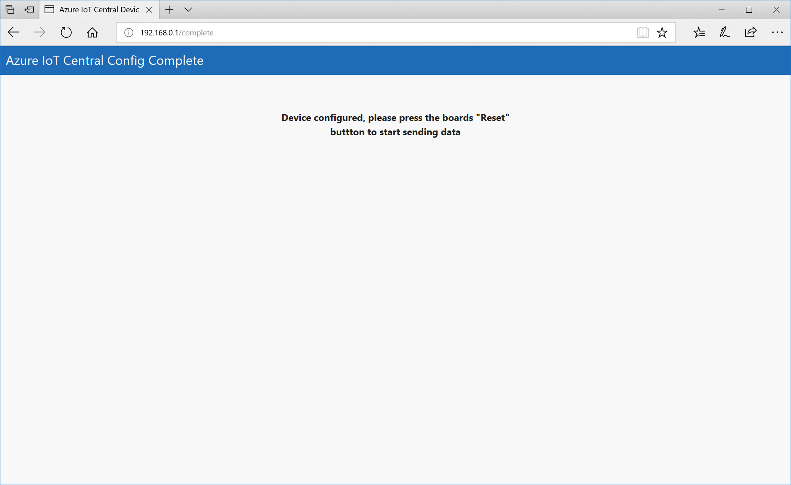

# Microsoft IoT Central Reference Firmware for AZ3166 dev kit

## Description:

An example of writing a firmware solution to send data to IoT Central and to receive events back from IoT Central to be processed by the device.  You are free to take this code and the concepts used, and use them as a basis for your own firmware for IoT Central.

The aim of this firmware and code is two-fold:

- To provide a good "out of the box" experience for someone wanting to connect a device to IoT Central and see real data sent to IoT Central.  The firmware was designed to simplify the onboarding experience via a web UX configuration and allow non-developer users to get a device onto IoT Central very easily.
- To illustrate how to write a functioning firmware for an mbed device that supports the features of IoT Central.  The code pulls together many of the individual samples available in the Azure IoT device C SDK into a cohesive story, using relatively simple code.  The code was written in C using the Arduino libraries in an attempt to make it accessible to all development levels from hobbyist to professional.  Tooling for the code is done with Visual Studio Code and the Arduino plugin allowing for visual debugging in the IDE of the code.

***

## Features implemented:

- Simple onboarding via a web UX
- Simple device reset (press and hold the A &amp; B buttons at the same time)
- Display shows count of messages, errors, twin events, network information, and device name (cycle through screens with B button)
- Telemetry sent for all onboard sensors (configurable)
- State change telemetry sent when button A pressed and the device cycles through the three states (NORMAL, CAUTION, DANGER)
- Reported twin property sent for double tap of device (uses accelerometer sensor data)
- Desired twin property to simulate turning on a fan (fan sound plays from onboard headphone jack)
- Cloud to device messages (supports sending a message to display on the screen)
- Direct twin method calls (supports asking the device to play a rainbow sequence on the RGB LED)
- LED status of network, Azure IoT send events, Azure IoT error events, and current device state (NORMAL=green, CAUTION=amber, DANGER=red)

***

## The board and it&#39;s features:


Pressing the B button will rotate through three screens of information in the following order "data transmission statistics" -&gt; "Device information" -&gt; "Network information" –&gt; back to "data transmission statistics".  The screens look like this:


The Data transmission screen (first screen above) has the following information by line:

- Count of sent telemetry events (includes telemetry payloads and state change telemetry payloads)
- Count of failed telemetry events
- Twin events desired / reported

** **

## The device telemetry payload:

Depending on how you configure the device it will send a subset of this telemetry payload.  A full telemetry payload will look like this when observed in the iothub-explorer event-monitor command:

```
{
  "humidity": 40,
  "temp": 26.6,
  "pressure": 1007.98,
  "magnetometerX": 43,
  "magnetometerY": 217,
  "magnetometerZ": -675,
  "accelerometerX": 13,
  "accelerometerY": -122,
  "accelerometerZ": 1019,
  "gyroscopeX": -350,
  "gyroscopeY": -980,
  "gyroscopeZ": 1400
}
```

Type, units, and range for the telemetry is:

| **Measure** | **Type** | **Units** | **Min** | **Max** |
| --- | --- | --- | --- | --- |
| humidity | float | % relative humidity | 0 | +100 |
| temp | float | °C | -40 | +120 |
| pressure | float | hPa | +260 | +1260 |
| magnetometerX,Y,Z | int | mgauss | -1000 | +1000 |
| accelerometerX,Y,Z | int | micro g (mg) | -2000 | +2000 |
| gyroscopeX,Y,Z | int | Micro degrees per second (mdps) | -2000 | +2000 |


Each telemetry also has a timestamp property associated with it in the format

```
{
  "timestamp": "Sun Oct  1 18:18:36 2017"
}
```

***

## General onboarding the device onto an IoT Hub:

For testing purposes, you may want to add the device to a general IoT Hub, so you can observe the device in action easier as you have access to the hub and device connection string.  The following steps will get the device connected to your hub and sending data.  Many of these steps will be repeated when adding the device to ioT Central.

### Step 1:

Take the device out of the box and plug it into a USB power supply (USB power adapter, USB powered hub, Computer USB socket).  The device should power up with the following screen displayed:



The device is now in access point (AP) mode and is providing a WiFi access point that you can connect to.  Before we connect to this WiFi we need to get a device connection string for the device to use.  Go to the Azure portal ( [https://portal.azure.com](https://portal.azure.com/) ) and sign in.  Either go to your IoT hub that you have provisioned or provision a new hub (a free hub sku will work fine) from the market place (instructions for doing this can be found here ( [https://docs.microsoft.com/en-us/azure/iot-hub/iot-hub-csharp-csharp-getstarted](https://docs.microsoft.com/en-us/azure/iot-hub/iot-hub-csharp-csharp-getstarted) ).

Once you have a hub provisioned select "Device Explorer" in the left navigation menu and click the &#39;+&#39; icon to add a new device.  Give the device a name and then click "Save".  The device will be displayed in the list of devices and you need to click the device to get to the device details page.  Now click the Copy icon to the right of the Connection string – primary key to copy the connection string into the copy/paste buffer of your computer.



You can leave it in the copy/paste buffer or copy it into notepad for safe keeping.  If you are new to using IoT Hub and the Azure Portal please follow the detailed instructions found in the getting started guide ( [https://docs.microsoft.com/en-us/azure/iot-hub/iot-hub-csharp-csharp-getstarted](https://docs.microsoft.com/en-us/azure/iot-hub/iot-hub-csharp-csharp-getstarted) ).

### Step 2:

Now change the WiFi of your computer, phone, or tablet to the name shown on the screen of the device.  Once connected you will see that you do not have internet access, this is expected, and we shall only be on this network for a short time as we configure the device.  Open your internet browser and enter the URL [http://192.168.0.1/start](http://192.168.0.1/start) .  The following web page should be displayed:

 

Select from the dropdown the WiFi network your device should connect to.  The list will only contain networks that the device is capable of connecting to so don&#39;t be surprised if not all networks you see on your computer are visible.  After selecting the WiFi network, enter the password for the network.  Then paste in the device connection string we obtained in step 2 into the connection string field.  Now select the telemetry data you want the device to send to your hub.  By default all are selected but you are free to select only a few if you want.  You can select zero telemetry options but then you will be sending just an empty JSON body to the hub each time and that&#39;s not very interesting.

Click the "Configure Device" button on the page when you are ready and the configuration data will be sent to the device and saved in the EEPROM on the device, so it will not be lost during power cycles of the device. You should now see the following web page:

 
 

### Step 3:

Reset the device by pressing the reset button on the upper right corner of the device:


The device will reboot and connect to the WiFi network you chose in step 2 and start sending telemetry data to your hub.  The device should now show the following on it&#39;s display:

 

### Step 4:

We can confirm that data is being sent by using the iothub-explorer tool.  To use the tool you will need to have node.js installed ( [https://nodejs.org](https://nodejs.org/) ) then from the command line issue the command (you may need to use sudo or an admin command line to install this):

```
npm install –g iothub-explorer
```

Now use the command:

```
iothub-explorer monitor-events <device-name> --login "HostName=xxxxxx.azure-devices.net;SharedAccessKeyName=iothubowner;SharedAccessKey=xxxxxxxxxxxxxxxxxxxxxxxxxxxxxxxxxxx"
```

You can get the &lt;device-name&gt; by pressing the B button on the device to get to the device information screen, the second line is the device name.  For the hub connection string return back to the Azure portal ( [https://portal.azure.com](https://portal.azure.com/) ) and go to your hub.  Then select from the left-hand navigation menu "Shared access policies", click on "iothubowner", and click the copy icon to the right of "Connection string – primary key".

After executing the command you should start to see the telemetry data being streamed from your device to the IoT Hub.  Congratulations you have connected the device to Azure IoT, continue reading to see what else the device can do now it&#39;s connected to your Azure IoT Hub.

***

## Onboarding the device to Microsoft IoT Central:

Coming soon ...

***

## Sending telemetry:

The device sends telemetry automatically every 5 seconds when running.  The count of sent telemetry will increment every 5 seconds and the blue Azure LED will blink when telemetry is sent by the device.  The telemetry sent will vary based on the selections you made in the configuration of the device.  The telemetry can be observed from the IoT Hub side by using the iothub-explorer command:

```
iothub-explorer monitor-events <device-name> --login "HostName=xxxxxx.azure-devices.net;SharedAccessKeyName=iothubowner;SharedAccessKey=xxxxxxxxxxxxxxxxxxxxxxxxxxxxxxxxxxx"
```

The device name can be obtained from the device screen on the devices display by pressing the B button to rotate the display to that screen.  The hub connection screen can be obtained from the Azure Portal web page for your hub.

***

## Sending State telemetry updates:

Status changes are a form of telemetry sent by a device to IoT Central.  The device firmware is coded to send a device state change when the A button is pressed.  This rotates the device through three states: Normal, Caution, and Danger.  Each state change sends a telemetry payload that looks like this:

```
{
  "deviceState": "CAUTION"
}
```

With an associated timestamp property in the format:

```
{
  "timestamp": "Sun Oct  1 18:02:16 2017"
}
```

This state change telemetry can be observed using iothub-explorer command:

```
iothub-explorer monitor-events <device-name> --login "HostName=xxxxxx.azure-devices.net;SharedAccessKeyName=iothubowner;SharedAccessKey=xxxxxxxxxxxxxxxxxxxxxxxxxxxxxxxxxxx"
```

The device name can be obtained from the device screen on the devices display by pressing the B button to rotate the display to that screen.  The hub connection screen can be obtained from the Azure Portal web page for your hub.  Note that the device change event will be surrounded by normal telemetry events in the output.

***

## Sending the "doubleTap" reported property:

Tapping the board on the desk a couple of times will generate a doubletap event from the accelerometer sensor and a reported property is set that contains a timestamp of the double tap event.  The right-hand number on the display for the twin line will also be incremented when the reported property is written to the twin.  The reported property looks like this:

```
reported:
    doubleTap:
      timestamp: Sat Sep 30 17:01:32 2017
```

The reported property can be checked by issuing the following iothub-explorer command to display the current twin setting:

```
iothub-explorer get-twin <device-name>
```

Note that this reported property can only be sent every 20 seconds maximum.  Any double tap events registered during the 20 second window of a previously sent reported property will be ignored.

** **

## Setting the twin "fanSpeed" desired property:

By sending a desired property to the device the fan speed can be set to a value.  The command to set the desired property using iothub-explorer is:

```
iothub-explorer update-twin <device-name> '{"properties":{"desired":{"fanSpeed":{"value":100}}}}'
```

When the desired property is set on the cloud (IoT hub) side the desired state will be sent to the device.  If you have headphones connected to the device, you will hear the sound of a fan running for a short period of time (~2 seconds).  The device will also acknowledge the desired request by sending a matching reported property with the value, a status, and a desired version that will match the $version of the desired property request.  When a desired property is received the left-hand number on the twin line of the display will be incremented and when the desired property is acknowledged the right-hand number will be incremented.  Be aware that there can be a small lag between the twin properties being set on the device and being observed in the cloud (and visa-versa) We can look at the twin with the following iothub-explorer command:

```
iothub-explorer get-twin <device-name>
```

We should see the following desired and reported properties:

```
properties:
  desired:
    fanSpeed:
      value: 100
      $version:  4

  reported:
    fanSpeed:
      value:          100
      status:         complete
      desiredVersion: 4
```

If several desired properties are set whilst the device is off line then they will be stored in the cloud until the device next connects.  Then the full digital twin is sent down to the device and all the desired properties will be checked to see if they have been acted upon.  The firmware looks at each desired property and looks for an equivalent reported property.  If the reported property is not found or the desired version numbers do not match then the desired property is acted upon and the reported property updated to reach a consistent state.  We can mimic this behavior by disconnecting the device then issuing the command:

```
iothub-explorer update-twin <device-name> '{"properties":{"desired":{"fanSpeed":{"value":100}}}}'
```

Then reconnect the device and after a number of telemetry sends (about five or six) the twin will be received and you should hear the fan noise and see the twin counter increment on the display.  You can check that the twin has become consistent by looking at the twin in the cloud using the command:

```
iothub-explorer get-twin <device-name>
```

***

## Calling the "rainbow" direct method:

The firmware supports two method operations direct method calls and cloud to device method calls.  The direct method is an immediate call if the device does not acknowledge the method request in a defined time span the method is assumed to have failed.  The direct method would be used for always connected devices where the action needs to be immediate (for example: open a cars door remotely).  Cloud to device methods do not require the device to be online at the time they are issued.  They are stored for a period of time in the cloud and issued to the device when they next connect if they are not currently on-line.  These methods are good for actions that can be performed without time sensitivity or for devices that infrequently connect to the cloud.  A cloud to device action might be a firmware upgrade request that is sent to the device when it next connects.

The firmware supports the direct method called "rainbow" when issued the RGB LED is cycled through the RGB rainbow a defined number of times.  To perform the action, we can use the iothub-explorer command:

```
iothub-explorer device-method <device-name> rainbow '{"cycles":3}' 3600
```

Note that the we have asked the rainbow pattern to be exercised 3 times and the time limit for the action to complete and be acknowledged is 1 minute (3600 seconds).  When the command is executed on the board the RGB LED should rainbow cycle three times.

***

## Calling the "message" cloud to device method:

The second form of method is a cloud to device method.  The firmware supports a cloud to device method called "message".  The method takes a text message as a parameter in the payload.  We can issue the cloud to device method using iothub-explorer with the command:

```
iothub-explorer send <device-name> '{"methodName":"message", "payload":{"text":"Hello from IoT Central"}}'
```

The device should then display the message briefly on the devices screen.

***

## Resetting the device:

To reset the board press and hold both the A and the B buttons together until the device displays "Resetting device".  The device will then return to the AP mode and display the WiFi hotspot name for you to connect to and reconfigure the board.  This action wipes all the configuration data from the device, essentially factory resetting it.

***

## Updating the firmware on the device:

The firmware on the device can be updated by downloading a newer version of the firmware from Microsoft IoT Central (URL to be defined at a later date).  Then with the device connected to the computer the file (iotCentral&lt;version&gt;.bin) can be copied onto the drive named AZ3166.  Once the file has been copied onto the device it will reset itself and boot up with the new firmware version.  All configuration will remain on the device and if there are no breaking changes in the configuration the device will connect to Azure IoT and start sending data.

***

## Building the firmware:

### Prerequisites:

- Install the Azure IoT Developer Kit by following the manual installation instructions at [https://microsoft.github.io/azure-iot-developer-kit/docs/installation/](https://microsoft.github.io/azure-iot-developer-kit/docs/installation/) .  There are instructions for Windows and macOS PC&#39;s.  You can ignore Step 1 as this is not needed to build the firmware.
- Ensure your device has been upgraded to the latest base firmware.  Instructions for downloading the firmware from here [https://microsoft.github.io/azure-iot-developer-kit/versions/](https://microsoft.github.io/azure-iot-developer-kit/versions/)
- Install Git tools for your operating system
- Clone the IoTCentral firmware repository on Github [https://github.com/Azure/azure-iot-central-firmware](https://github.com/Azure/azure-iot-central-firmware)


Opening the code in Visual Studio Code and getting connected to the device:

- Connect the development board to your computer via the USB cable
- From the command line change directory into the directory you cloned the repo and use the command:  code .
- Once VS Code loads you should set the serial port of the board.  Use `CTRL+SHIFT+P` macOS (`CMD+SHIFT+P`) and type **Arduino** then find and select **Arduino: Select Serial Port**. A list of serial ports will be displayed select the one the device is connected to.  In windows this can be found by looking at the device manager and looking in Ports for the COM port for the STMicroelectronics STLink Virtual COM Port.  On macOS the port will be the one with /dev/cu.usbmodemXXXX STMicroElectronics
- Set the Serial board rate to 250000.  Use `CTRL+SHIFT+P` macOS (`CMD+SHIFT+P`) and type **Arduino** then find and select **Arduino: Change Baud rate** and select 250000 from the list.

Building and uploading the code to the device:

- To build the code use `CTRL+SHIFT+P` macOS (`CMD+SHIFT+P`) and type **Arduino** then find and select **Arduino: Upload**
- The source will build and be uploaded to the device, this can take several minutes.  If there are errors they will be displayed in the Output window
- Once uploaded the device will restart and boot into the newly uploaded firmware and start executing

### Debugging:

You can debug via Serial print commands in the code or with the ST-Link debugger that provides full visual debugging.  To observe Serial output you need to start the serial port monitor in VS Code.  Use `CTRL+SHIFT+P` macOS (`CMD+SHIFT+P`) and type **Arduino** then find and select **Arduino: Open Serial Monitor**.  The Serial port monitor will be opened in the output window and serial port messages will be displayed.  If the output is garbled then check to make sure you have the baud rate set at 250000.

For more complete debugging you can select the debug tool on the left-hand toolbar of VS Code.  Then set any breakpoints in the code as normal and press the debug play button in the top left-hand corner.  The debugger will start shortly and breakpoints will be observed.  When a breakpoint fires you can look at variable values and step through the code like any normal debugging session.

### Note :

- Debugging the device can be a little unstable at times, placing breakpoints during debugging will sometimes not be honored and stepping through the code is quite slow.
- When exiting debugging (pressing the stop button in the debugger toolbar) the device might be in an inconsistent state (programming LED flashing) this will result in uploads failing and new debugging sessions also failing.  To resolve this unplug the USB cable from the computer and plug it back in.  the device and COM port will reset and the device will function normally from that point on.
- When debugging a shadow copy of the code is used and will be shown in the VS code editor.  Be aware that making changes in the shadow copy will not be persisted in the real source code and you will lose them in subsequent builds.  Believe me I have had this happen so many times, it is very frustrating and a poor feature of the Arduino VS Code extension.  – BE AWARE OF THIS!!

***

## Troubleshooting:

- Sometimes when resetting the device the web page for configuring the device ( [http://192.168.0.1/start](http://192.168.0.1/start) ) will fail to load or display a blank page.  Please reset the device and it will come up in AP mode and you can reconnect to the WiFi hotspot the board supplies and try to access the page again.

***

## Contributing:

This project welcomes contributions and suggestions. Most contributions require you to agree to a Contributor License Agreement (CLA) declaring that you have the right to, and actually do, grant us the rights to use your contribution. For details, visit  [https://cla.microsoft.com](https://cla.microsoft.com/).

When you submit a pull request, a CLA-bot will automatically determine whether you need to provide a CLA and decorate the PR appropriately (e.g., label, comment). Simply follow the instructions provided by the bot. You will only need to do this once across all repos using our CLA.

This project has adopted the  [Microsoft Open Source Code of Conduct](https://opensource.microsoft.com/codeofconduct/). For more information see the  [Code of Conduct FAQ](https://opensource.microsoft.com/codeofconduct/faq/) or contact  [opencode@microsoft.com](mailto:opencode@microsoft.com) with any additional questions or comments.