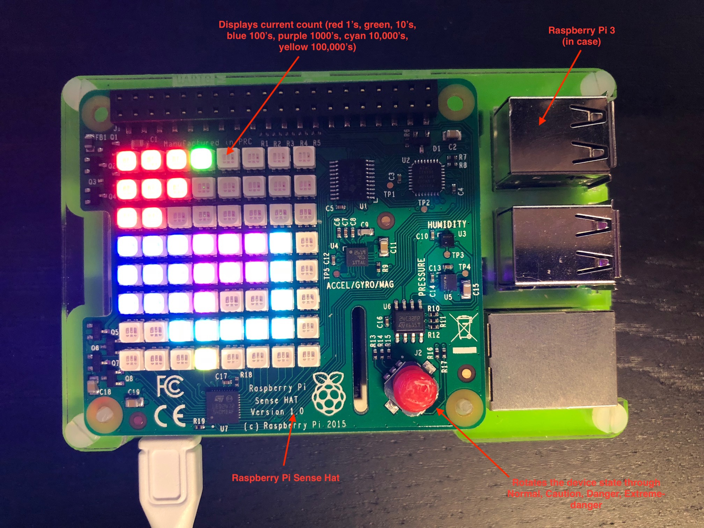

# Azure IoT Central Reference Firmware for Raspberry Pi 2/3

## Description:

An example of writing a firmware solution to send data to Azure IoT Central and to receive events back from Azure IoT Central to be processed by the device.  You are free to take this code and the concepts used, and use them as a basis for your own firmware for Azure IoT Central.

The aim of this firmware and code is two-fold:

- To provide a good "out of the box" experience for someone wanting to connect a device to Azure IoT Central and see real data sent to Azure IoT Central.  The firmware was designed to simplify the onboarding experience via a web UX configuration and allow non-developer users to get a device onto Azure IoT Central very easily.
- To illustrate how to write a functioning firmware for a Raspberry Pi.  The code pulls together many of the individual samples available in the Azure IoT device SDK into a cohesive story, using relatively simple code.

## Features Implemented:

- Telemetry sent for all onboard sensors (configurable)
- State change telemetry sent when the joystick is pressed in a direction (NORMAL, CAUTION, DANGER, EXTREME-DANGER)
- Reported twin property die number is sent when shaking the device  (uses accelerometer sensor data)
- Desired twin property to simulate turning on a fan (fan sound plays from onboard headphone jack)
- Desired twin properties of current and voltage of the device (trigger a bar graph animation)
- Desired twin property of IR blaster (compatible with the MXChip variant but with no IR blaster on the board it just does an animation on the LED matrix)
- Cloud to device messages (supports sending a message to display on the screen)
- Direct twin method calls (supports asking the device to play a rainbow sequence on the RGB LED)
- LED status of network, Azure IoT send events, Azure IoT error events, and current device state (NORMAL=green, CAUTION=amber, DANGER=red)

## The board and its features:

You will need the following hardware for the project:

- A Raspberry Pi 2/3 connected to the internet [RaspberryPi.org](https://www.raspberrypi.org/learning/hardware-guide/)
- A microSD card 8GB or larger
- A Pi Sense hat [here](https://www.raspberrypi.org/products/sense-hat/)
- Keyboard, mouse, HDMI monitor, micro USB cable, and USB power supply (you can use your computer to power the Rapberry Pi 3)
- An active internet connection (either via Ethernet cable or WiFi)

*&nbsp;if you don't have a Pi Sense Hat you can use the built in [Sense Hat emulator](http://sense-emu.readthedocs.io/en/v1.0/) built into the Raspberry Pi operating system

You should install the latest Raspian operationg system by following these instructions (https://www.raspberrypi.org/learning/software-guide/)

## Setting up the device

tips;
*This sample only works with `Raspbian` (stretch).*
*What is scope-id? See [general documentation site](https://aka.ms/iotcentral-doc-raspi)*

Please follow the steps below;

- Update `main.py` `ID_SCOPE =        "<scope id>" # put the scope id here` with your scope-id
- Copy the contents of the `RaspberryPi` folder into your Raspberry Pi.

**X509**
- Please use [this tool](https://github.com/azure/iot-central-firmware/tree/master/tools/dice) to create the sample x509 root cert (dice_device_provision) for your Azure IoT Central account.
- Find `SECURITY_DEVICE_TYPE = ProvisioningSecurityDeviceType.X509 # OR .SAS` line under `main.py` and make sure `X509` is being used
- Run `./start.sh`
- See `riot-device-cert` device under the Azure IoT Central `Device Explorer` `Unassociated devices` page.
Go ahead and associate with Raspberry Pi template in order to make the sample functioning properly.

**SAS**
Take a look at the sample `dps.py` for generating connection string using the
`Primary or Secondary` / `Scope ID` from Azure IoT Central with your choice of `device id`

Current Python sample is based on `x509` with builtin sample certificate. Feel
free to update the logic to symmetric key by uncommenting the x509 related part under `provision_device`

As a next step; you should define both `SYMMETRIC_KEY_VALUE` and `REGISTRATION_NAME` under
`azure-iot-sdk-python/c/dps_symm_key/provisioning_client/adapters/hsm_client_key.c`

Now, compile the Python SDK by following [this documentation](https://github.com/Azure/azure-iot-sdk-python/blob/master/doc/python-devbox-setup.md)
*Remember; you already cloned a specialized Python SDK and you shouldn't clone it again*

As a next step, find and copy `provisioning_device_client.so` and `iothub_client.so` under the build
and update the `src` folder of this repository with those.

Finally, find `SECURITY_DEVICE_TYPE = ProvisioningSecurityDeviceType.X509 # OR .SAS` line under `main.py` and make sure `SAS` is being used

## Connecting the device to Azure IoT Central:

Please visit our [general documentation site](https://aka.ms/iotcentral-doc-raspi) for a tutorial on how to connect the device to Azure IoT Central.

## Resetting the Device:

At any point you can reconfigure the device by going to the configuration web page at (http://&lt;ip-of-raspberry-pi&gt;/start) and changing any of the values.  After making changes to the device it is necessary to stop and restart the python process to ensure the new configuration is picked up.

## Contributing

This project welcomes contributions and suggestions.  Most contributions require you to agree to a
Contributor License Agreement (CLA) declaring that you have the right to, and actually do, grant us
the rights to use your contribution. For details, visit https://cla.microsoft.com.

When you submit a pull request, a CLA-bot will automatically determine whether you need to provide
a CLA and decorate the PR appropriately (e.g., label, comment). Simply follow the instructions
provided by the bot. You will only need to do this once across all repos using our CLA.

This project has adopted the [Microsoft Open Source Code of Conduct](https://opensource.microsoft.com/codeofconduct/).
For more information see the [Code of Conduct FAQ](https://opensource.microsoft.com/codeofconduct/faq/) or
contact [opencode@microsoft.com](mailto:opencode@microsoft.com) with any additional questions or comments.
