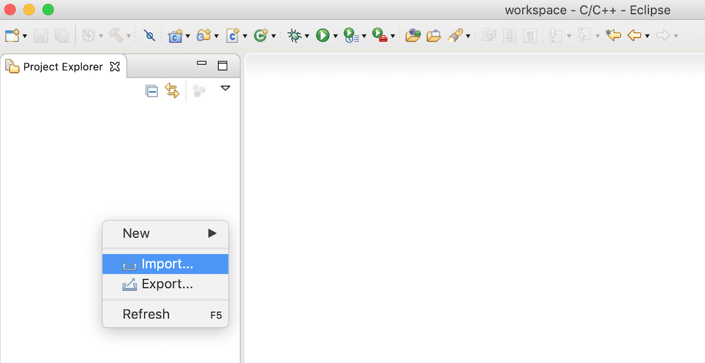
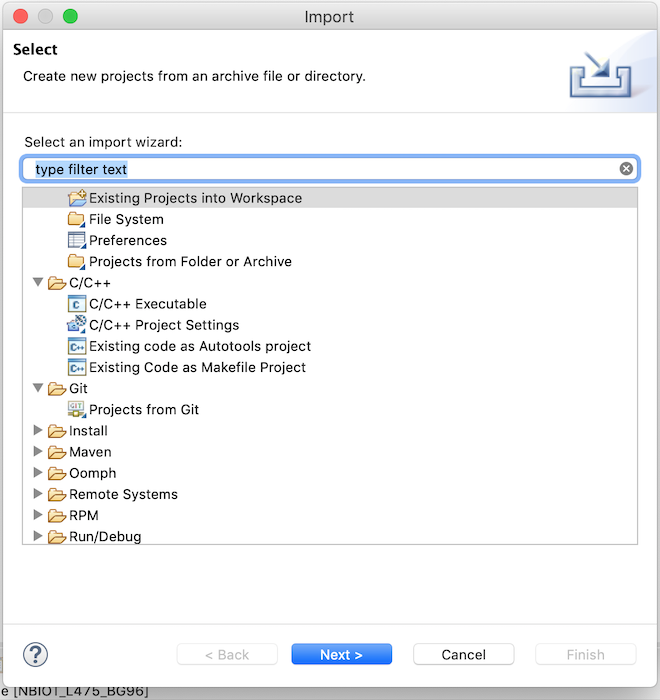
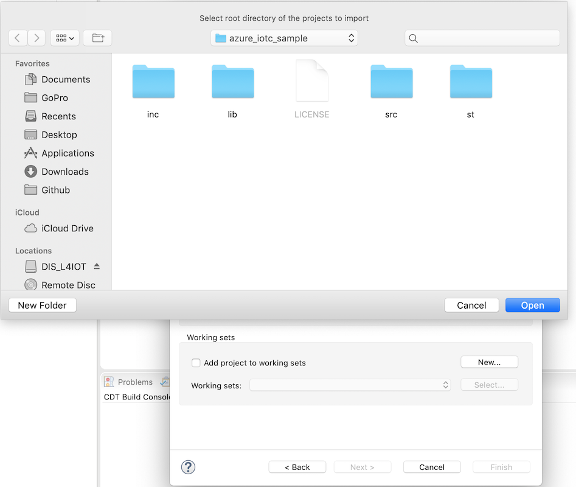
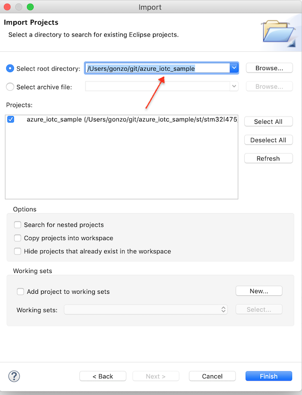
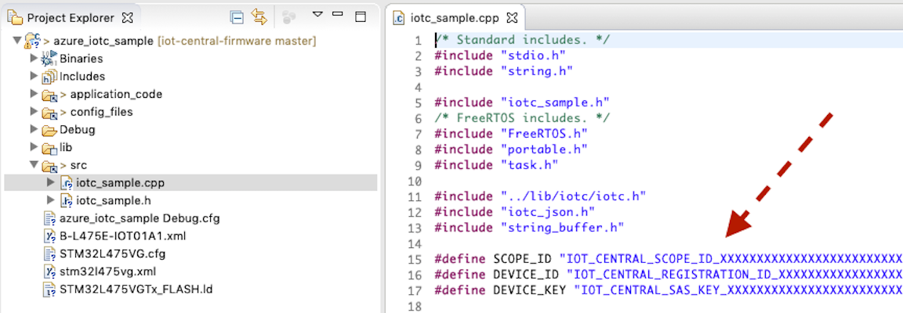
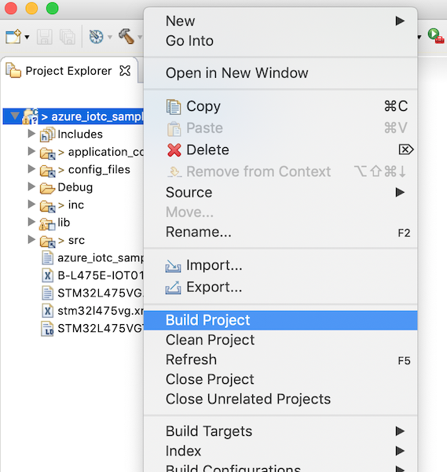

## Step by step - Azure IoT - Free RTOS verizon kit sample (b-l475e-iot01a1-bg96)

### Setting up the dev environment and building the sample

- Download `OpenSTM32 SystemWorkbench` from [this URL](http://www.openstm32.org/Downloading%2Bthe%2BSystem%2BWorkbench%2Bfor%2BSTM32%2Binstaller) You will need to register / login to access downloads.

- Clone this repository -> `git clone https://github.com/azure/iot-central-firmware`

- Open `SystemWorkbench` on your desktop.

- Right click to empty white space on the `project explorer` tab. Select `Import`

- Select `Existing Projects into Workspace` and click `Next`

- Browse into `iot-central-firmware/freeRTOS/b-l475e-iot01a1-bg96-verizon/azure_iotc_sample` folder

- See `azure_iotc_sample` folder is selected as root directory and click `Finish`

- Visit [AzureIoTCentral](https://apps.azureiotcentral.com) and create a `new application`.
- Select `Sample Devkits`
- Add a new `mxchip` device. (a real device) (under `Device Explorer`)
- Browse into device UI (by clicking to name of the device under `Device explorer`)
- Click/open `Connect` at top-right of the device UI
- Grab `scopeId`, `device Id` and `primary key` (DEVICE_KEY) and fill the necessary parts under `iotc_sample.cpp` as shown on the screenshot below.

- Right click to `azure_iotc_sample` project name on the `project explorer` tab and
click to `Build Project`

- If you see any error, again right click to `azure_iotc_sample` but this time select, `Index` > `Rebuild`.. and then Build the project as explained on the previous step.

- Finally, you will find the binary file (`azure_iotc_sample_debug.bin`) under
`azure_iotc_sample/st/stm32l475_discovery/ac6/Debug` location. (this location is relative to project folder you have cloned).

- Connect your board to your computer. If you are on Windows, you will need to install a driver from `https://www.st.com/en/development-tools/stsw-link009.html`

- Drag and drop the `azure_iotc_sample_debug.bin` file into board from the file explorer. You should see the board as an external usb drive.

### Api and pinpoints

- This sample uses `iotc` thin client api. See [IOTC.md](IOTC.md) for more.
- `src/iotc_sample.cpp` file contains the application logic and authentication to azure iot.
- Find `void iotc_main(void* pvParameters)` under `iotc_sample.cpp` to see
  - how to connect
  - how to send telemetry and reported properties
- `onConnectionStatus` / `onSettingsUpdated` / `onCommand` / `onEvent`.. are the callbacks for iotc client.

### Device logs

- in order to see the logs, you should look into serial terminal. i.e. `nodemcu` is a practical cross platform tool you may try. Install => `npm install -g nodemcu-tool`

- Find your board .. (on Windows, you should find the COM port, while on *nix, you should look into `/dev` folder)

i.e. `nodemcu-tool -p /dev/tty.usbmodem14103 -b 115200 terminal` was working on my machine. Do not expect `/dev/tty.usbmodem14103` to work on your machine. On Windows, it will be something like `COMXXX`. Look into `Device explorer` and see which USB COM port is used by ST driver. On `*nix` try `tab` key after `/dev/tty.` or `/dev/usb.` to see the available devices and select the right one.