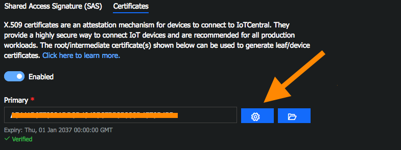

### Creating the sample x509 root certificate

This folder includes `dice_device_enrollment` tool for Windows, Linux, and OSX.

- Download the tool for your system and run
- Select `g` option
- Save the resulting certificate into a file and upload it to AzureIOTCentral (Administration/Device Connection)
- Go under the certificate settings

- Grab the Verification Code from the AzureIOTCentral UX and paste it back to `dice_device_enrollment` tool
- Tool will generate you a challenge response certificate. Save it to another file
- Click to `Verify` button on the UX and upload the response certificate
